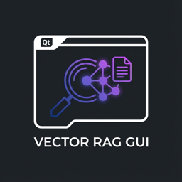

<p align="center">
  
</p>

# vector-rag-gui

[](https://www.python.org/downloads/)
[](LICENSE)

A Qt6 GUI for searching local FAISS vector stores with AI-powered research synthesis.

## Features

- Qt6 desktop GUI with GitHub-flavored markdown rendering
- Research mode with multi-source synthesis (local RAG, AWS docs, web search)
- Read-only file tools (glob, grep, read) for codebase exploration
- Multi-store selection for comprehensive local searches
- Real-time progress with token usage and cost tracking
- Dark/Light mode toggle
- System tray integration

## Installation

Requires Python 3.14+, [uv](https://github.com/astral-sh/uv), and [vector-rag-tool](https://github.com/dnvriend/vector-rag-tool).

```bash
git clone https://github.com/dnvriend/vector-rag-gui.git
cd vector-rag-gui
uv tool install .
```

## Configuration

AWS Bedrock credentials via environment variables:

```bash
export AWS_PROFILE="your-profile"
export AWS_REGION="us-east-1"

# Optional: Override model inference profiles
export ANTHROPIC_DEFAULT_SONNET_MODEL="arn:aws:bedrock:..."
export ANTHROPIC_DEFAULT_OPUS_MODEL="arn:aws:bedrock:..."
export ANTHROPIC_DEFAULT_HAIKU_MODEL="arn:aws:bedrock:..."
```

## Usage

```bash
# Launch GUI
vector-rag-gui

# Launch with specific store pre-selected
vector-rag-gui start --store my-knowledge-base

# List available stores
vector-rag-gui stores
vector-rag-gui stores --json

# Show configuration
vector-rag-gui config

# Verbose output
vector-rag-gui -v    # INFO
vector-rag-gui -vv   # DEBUG
vector-rag-gui -vvv  # TRACE
```

## Options

| Option | Description |
|--------|-------------|
| `-v, --verbose` | Increase verbosity (repeatable) |
| `-h, --help` | Show help message |
| `--version` | Show version |

### Commands

| Command | Description |
|---------|-------------|
| `start` | Launch GUI (default) |
| `stores` | List available vector stores |
| `config` | Show current configuration |
| `completion` | Generate shell completion script |

## Keyboard Shortcuts

| Shortcut | Action |
|----------|--------|
| `Ctrl+L` | Focus search input |
| `Ctrl+R` | Refresh stores |
| `Ctrl+D` | Toggle dark/light mode |
| `Ctrl+I` | Show store info |
| `Ctrl+M` | Minimize to tray |
| `Ctrl+Q` | Quit |

## Development

```bash
make install    # Install dependencies
make test       # Run tests
make check      # Run all checks (format, lint, typecheck, test, security)
make pipeline   # Full CI pipeline
```

## License

[MIT](LICENSE)

## Author

Dennis Vriend - [@dnvriend](https://github.com/dnvriend)
